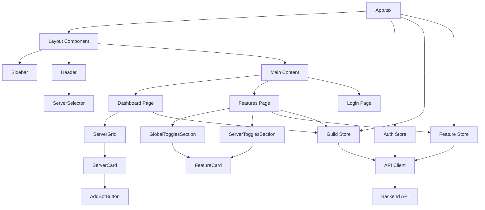
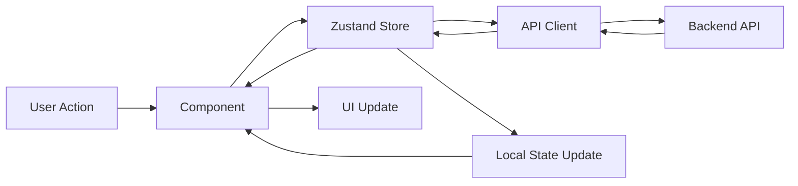
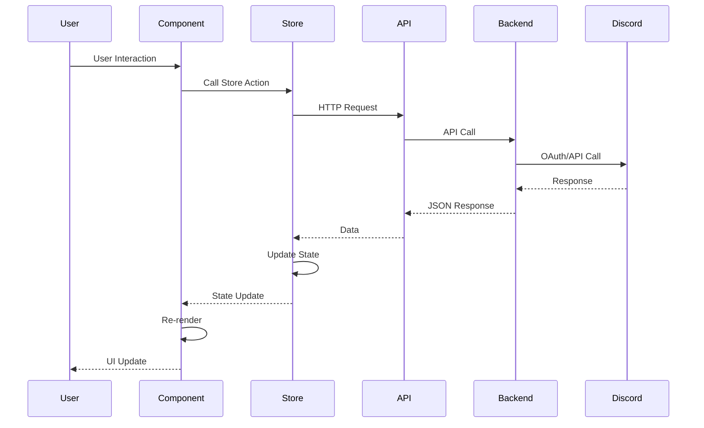
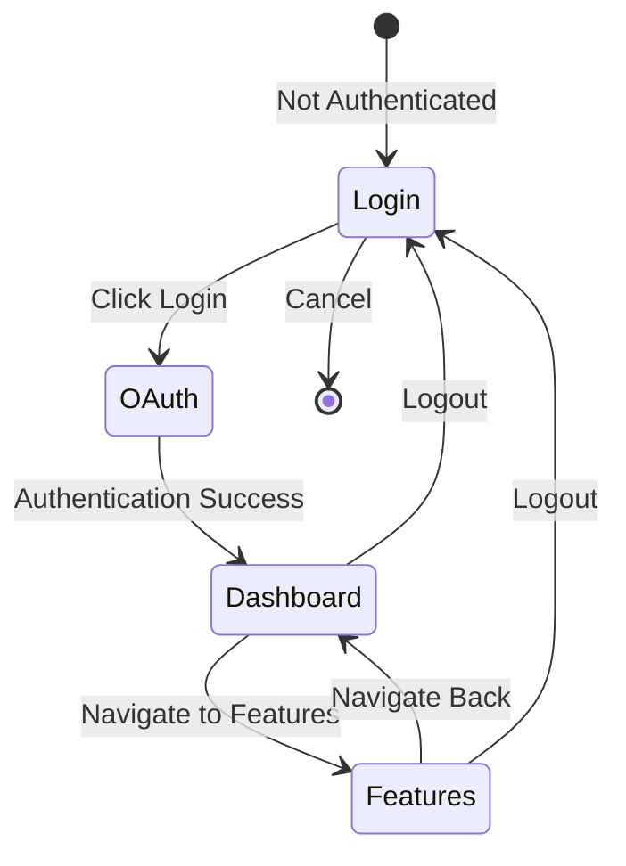

# Frontend Web Application Documentation

## Overview

The LukBot frontend is a modern React-based web application that provides a user-friendly interface for managing Discord bot features. It enables Discord server administrators to authenticate via Discord OAuth2, view their servers, check bot status, and manage feature toggles (both global developer toggles and per-server admin toggles).

### Key Features

- **Discord OAuth2 Authentication**: Secure authentication using Discord's OAuth2 flow
- **Guild Management**: View and manage Discord servers where the user is an administrator
- **Feature Toggle Management**: Two-tier system for global (developer) and per-server (admin) feature toggles
- **Real-time Updates**: Live status updates and responsive UI
- **Responsive Design**: Mobile-first design that works across all device sizes
- **Dark Mode**: Custom dark theme optimized for extended use

### Relationship to Other Services

The frontend communicates with:

- **Backend API** (`src/webapp/`): Express.js server providing REST API endpoints
- **Discord API**: For OAuth authentication and guild information
- **Redis**: Session storage (managed by backend)

See [ARCHITECTURE.md](ARCHITECTURE.md) for the complete system architecture.

## Technology Stack

### Core Framework

- **React 18.3.1**: Modern React with hooks and functional components
- **TypeScript 5.9.3**: Strict type checking for enhanced code quality
- **Vite 6.0.7**: Fast build tool and development server

### State Management

- **Zustand 5.0.2**: Lightweight state management library
    - Used for: Authentication state, guild management, feature toggle state

### Styling

- **Tailwind CSS 3.4.17**: Utility-first CSS framework
- **tailwindcss-animate 1.0.7**: Animation utilities
- **Custom Design System**: Dark mode palette with CSS variables

### HTTP & Routing

- **Axios 1.7.9**: HTTP client for API requests
- **React Router DOM 7.1.3**: Client-side routing

### UI Components

- **Lucide React 0.468.0**: Icon library
- **Custom Components**: Built following Shadcn/ui patterns
- **class-variance-authority 0.7.1**: Component variant management
- **clsx 2.1.1** & **tailwind-merge 2.6.0**: Utility functions for className management

### Optional Dependencies

- **Three.js 0.175.0** & **@react-three/fiber 8.17.10** & **@react-three/drei 9.114.3**: 3D graphics support (optional, for future enhancements)

### Library Recommendations

See [LIBRARY_RECOMMENDATIONS.md](../packages/frontend/LIBRARY_RECOMMENDATIONS.md) for detailed recommendations on:

- Recommended additions (e.g., TanStack Query for server-state management)
- Libraries to avoid
- Dependency health criteria
- Maintenance schedule

**Key Recommendation**: Consider adding **TanStack Query** (`@tanstack/react-query`) for improved data fetching patterns, caching, and reduced boilerplate around API calls.

## Project Structure

```
src/webapp/frontend/
├── src/
│   ├── components/           # React components
│   │   ├── Dashboard/       # Dashboard-specific components
│   │   │   ├── AddBotButton.tsx
│   │   │   ├── ServerCard.tsx
│   │   │   └── ServerGrid.tsx
│   │   ├── Features/        # Feature toggle components
│   │   │   ├── FeatureCard.tsx
│   │   │   ├── GlobalTogglesSection.tsx
│   │   │   └── ServerTogglesSection.tsx
│   │   ├── Layout/          # Layout components
│   │   │   ├── Header.tsx
│   │   │   ├── Layout.tsx
│   │   │   ├── ServerSelector.tsx
│   │   │   └── Sidebar.tsx
│   │   ├── ui/              # Reusable UI components
│   │   │   ├── Button.tsx
│   │   │   ├── Card.tsx
│   │   │   ├── LoadingSpinner.tsx
│   │   │   ├── PageLoader.tsx
│   │   │   ├── Skeleton.tsx
│   │   │   └── Toast.tsx
│   │   └── ErrorBoundary.tsx
│   ├── pages/               # Page components
│   │   ├── Dashboard.tsx
│   │   ├── Features.tsx
│   │   └── Login.tsx
│   ├── stores/              # Zustand state stores
│   │   ├── authStore.ts
│   │   ├── featureStore.ts
│   │   └── guildStore.ts
│   ├── services/            # API client
│   │   └── api.ts
│   ├── types/               # TypeScript type definitions
│   │   ├── auth.ts
│   │   ├── feature.ts
│   │   └── guild.ts
│   ├── lib/                 # Utility functions
│   │   └── utils.ts
│   ├── App.tsx              # Main app component with routing
│   ├── main.tsx             # Application entry point
│   └── index.css            # Global styles and CSS variables
├── index.html               # HTML template
├── package.json             # Dependencies and scripts
├── vite.config.ts           # Vite configuration
├── tailwind.config.js       # Tailwind CSS configuration
├── tsconfig.json            # TypeScript configuration
├── tsconfig.node.json        # TypeScript config for Vite
├── postcss.config.js        # PostCSS configuration
├── .eslintrc.cjs            # ESLint configuration
├── Dockerfile.dev           # Development Docker configuration
├── scripts/                 # Build and utility scripts
│   └── check-dependencies.ts # Dependency checking script
└── LIBRARY_RECOMMENDATIONS.md # Library recommendations and guidelines
```

## Architecture & Design Patterns

### Component Architecture Diagram



### Component Architecture

The application follows a functional component architecture with React hooks:

- **Functional Components**: All components are functional using hooks
- **Component Composition**: Complex components built from simpler ones
- **Separation of Concerns**: Clear separation between UI, state, and API logic

### State Management Pattern

Zustand stores provide centralized state management:

```typescript
// Store pattern example
import { create } from 'zustand'

interface StoreState {
    data: DataType[]
    isLoading: boolean
    fetchData: () => Promise<void>
}

export const useStore = create<StoreState>((set) => ({
    data: [],
    isLoading: false,
    fetchData: async () => {
        set({ isLoading: true })
        try {
            const response = await api.get('/endpoint')
            set({ data: response.data, isLoading: false })
        } catch {
            set({ data: [], isLoading: false })
        }
    },
}))
```

### API Integration Pattern

Axios with interceptors for consistent error handling:

```12:23:src/webapp/frontend/src/services/api.ts
api.interceptors.response.use(
  (response) => response,
  (error) => {
    if (error.response?.status === 401) {
      window.location.href = '/api/auth/discord'
    }
    const errorMessage = error.response?.data?.error || error.message || 'An error occurred'
    console.error('API Error:', errorMessage, error)
    return Promise.reject(error)
  },
)
```

### Routing Pattern

React Router with protected routes based on authentication:

```8:24:src/webapp/frontend/src/App.tsx
function App() {
  const { isAuthenticated } = useAuthStore()

  if (!isAuthenticated) {
    return <Login />
  }

  return (
    <Layout>
      <Routes>
        <Route path="/" element={<Dashboard />} />
        <Route path="/features" element={<Features />} />
        <Route path="*" element={<Navigate to="/" replace />} />
      </Routes>
    </Layout>
  )
}
```

### Styling Pattern

Utility-first Tailwind CSS with CSS variables for theming:

- **CSS Variables**: Defined in `index.css` for theme colors
- **Utility Classes**: Primary styling method using Tailwind utilities
- **Component Variants**: Using `class-variance-authority` for component variants
- **Responsive Design**: Mobile-first approach with Tailwind breakpoints

### Error Handling

- **Error Boundaries**: React error boundaries for component-level error handling
- **API Error Handling**: Axios interceptors for global API error handling
- **Toast Notifications**: User-friendly error messages via toast system

### Type Safety

Strict TypeScript configuration ensures type safety throughout:

- **Strict Mode**: Enabled in `tsconfig.json`
- **No Implicit Any**: All types must be explicitly defined
- **Type Definitions**: Separate type files for domain models

## Component Documentation

### Layout Components

#### Layout

Main layout wrapper providing sidebar and header structure.

**Location**: `src/components/Layout/Layout.tsx`

**Props**: `{ children: ReactNode }`

**Features**:

- Sidebar navigation
- Header with user info and server selector
- Scrollable main content area

#### Sidebar

Fixed sidebar navigation with active route highlighting.

**Location**: `src/components/Layout/Sidebar.tsx`

**Features**:

- Navigation items (Dashboard, Features)
- Active route highlighting with primary color
- Responsive: hidden on mobile, visible on desktop

#### Header

Top header bar with server selector and user information.

**Location**: `src/components/Layout/Header.tsx`

**Features**:

- Server selector dropdown
- User avatar and username
- Logout button
- Responsive: hides username on mobile

#### ServerSelector

Dropdown component for selecting which server to manage.

**Location**: `src/components/Layout/ServerSelector.tsx`

**Features**:

- Lists user's admin guilds
- Shows current selection
- Updates selected guild in guild store

### Dashboard Components

#### ServerGrid

Responsive grid layout displaying server cards.

**Location**: `src/components/Dashboard/ServerGrid.tsx`

**Features**:

- Responsive grid (1 column mobile, 2-3 columns desktop)
- Loading states with skeleton loaders
- Empty state when no servers found

#### ServerCard

Individual server card displaying server information and actions.

**Location**: `src/components/Dashboard/ServerCard.tsx`

**Props**: `{ guild: Guild }`

**Features**:

- Server icon or initial letter fallback
- Server name
- Bot status badge (green "Bot Added" or red "Not Added")
- Action button: "Manage" if bot added, "Add Bot" if not

#### AddBotButton

Button component for adding bot to a server.

**Location**: `src/components/Dashboard/AddBotButton.tsx`

**Props**: `{ guild: Guild }`

**Features**:

- Generates bot invite URL
- Opens Discord OAuth flow
- Loading state during invite process

### Feature Components

#### FeatureCard

Card component for displaying and toggling individual features.

**Location**: `src/components/Features/FeatureCard.tsx`

**Props**:

- `feature: Feature` - Feature information
- `enabled: boolean` - Current toggle state
- `onToggle: (enabled: boolean) => void` - Toggle handler
- `isGlobal: boolean` - Whether this is a global toggle

**Features**:

- Feature name and description
- Badge indicating "Global" (purple) or "Per-Server" (blue)
- Custom toggle switch
- Status text ("Enabled" / "Disabled")
- Toast notifications on toggle

#### GlobalTogglesSection

Section displaying global developer toggles.

**Location**: `src/components/Features/GlobalTogglesSection.tsx`

**Features**:

- Only visible to developers
- Lists all global feature toggles
- Allows toggling global features

#### ServerTogglesSection

Section displaying per-server feature toggles.

**Location**: `src/components/Features/ServerTogglesSection.tsx`

**Features**:

- Server selector for choosing which server to manage
- Lists per-server feature toggles
- Allows toggling per-server features
- Empty state when no server selected

### UI Components

#### Button

Reusable button component with variants and sizes.

**Location**: `src/components/ui/Button.tsx`

**Props**:

- `variant?: 'primary' | 'secondary' | 'accent' | 'ghost'`
- `size?: 'sm' | 'md' | 'lg'`
- Standard button HTML attributes

**Variants**:

- `primary`: Primary color background, white text
- `secondary`: Secondary color background, white text
- `accent`: Accent color background, white text
- `ghost`: Transparent, hover shows tertiary background

#### Card

Container component for card-based layouts.

**Location**: `src/components/ui/Card.tsx`

**Props**: Standard div HTML attributes

**Features**:

- Secondary background color
- Border with border color
- Rounded corners

#### Toast

Toast notification system for user feedback.

**Location**: `src/components/ui/Toast.tsx`

**Usage**:

```typescript
const { showToast } = useToast()
showToast('Message', 'success' | 'error' | 'info')
```

**Features**:

- Auto-dismiss after 3-5 seconds
- Slide-in animation
- Color variants for different message types

#### Skeleton

Loading skeleton component for content placeholders.

**Location**: `src/components/ui/Skeleton.tsx`

**Features**:

- Shimmer animation effect
- Customizable size and shape

#### LoadingSpinner

Reusable loading spinner component with customizable size and optional message.

**Location**: `src/components/ui/LoadingSpinner.tsx`

**Props**:

- `size?: 'sm' | 'md' | 'lg'` - Spinner size (default: 'md')
- `className?: string` - Additional CSS classes
- `message?: string` - Optional loading message

**Usage**:

```typescript
<LoadingSpinner size="lg" message="Loading data..." />
```

#### PageLoader

Full-page loading component for initial app load or route transitions.

**Location**: `src/components/ui/PageLoader.tsx`

**Props**:

- `message?: string` - Loading message (default: 'Loading...')

**Features**:

- Centered layout
- Full-screen coverage
- Consistent styling with app theme

#### ErrorBoundary

React error boundary for catching component errors.

**Location**: `src/components/ErrorBoundary.tsx`

**Features**:

- Catches React component errors
- Displays user-friendly error message
- Prevents entire app crash

### Pages

#### Login

Authentication page with Discord OAuth login.

**Location**: `src/pages/Login.tsx`

**Features**:

- Centered layout with branding
- "Login with Discord" button
- Loading state during authentication check
- Redirects to dashboard after authentication

#### Dashboard

Main dashboard page displaying user's servers.

**Location**: `src/pages/Dashboard.tsx`

**Features**:

- Fetches and displays user's admin guilds
- Server grid with server cards
- Navigation to features page

#### Features

Feature management page for toggling features.

**Location**: `src/pages/Features.tsx`

**Features**:

- Global toggles section (developer only)
- Per-server toggles section
- Server selector for per-server features
- Fetches features and toggle states

## State Management

### State Management Flow



### Store Architecture

The application uses Zustand for state management with three main stores:

### Auth Store

Manages user authentication state and session.

**Location**: `src/stores/authStore.ts`

**State**:

```typescript
interface AuthState {
    user: User | null
    isAuthenticated: boolean
    isLoading: boolean
    checkAuth: () => Promise<void>
    logout: () => Promise<void>
}
```

**Methods**:

- `checkAuth()`: Checks authentication status with backend
- `logout()`: Logs out user and redirects to login

**Usage**:

```typescript
const { user, isAuthenticated, checkAuth, logout } = useAuthStore()
```

### Guild Store

Manages Discord server (guild) information and selection.

**Location**: `src/stores/guildStore.ts`

**State**:

```typescript
interface GuildState {
    guilds: Guild[]
    selectedGuildId: string | null
    isLoading: boolean
    fetchGuilds: () => Promise<void>
    setSelectedGuild: (guildId: string | null) => void
    getSelectedGuild: () => Guild | null
}
```

**Methods**:

- `fetchGuilds()`: Fetches user's admin guilds from API
- `setSelectedGuild(guildId)`: Sets the currently selected guild
- `getSelectedGuild()`: Returns the currently selected guild object

**Usage**:

```typescript
const { guilds, selectedGuildId, fetchGuilds, setSelectedGuild } =
    useGuildStore()
```

### Feature Store

Manages feature toggles and feature information.

**Location**: `src/stores/featureStore.ts`

**State**:

```typescript
interface FeatureState {
    globalToggles: FeatureToggleState
    serverToggles: FeatureToggleState
    features: Feature[]
    isLoading: boolean
    isDeveloper: boolean
    fetchFeatures: () => Promise<void>
    fetchGlobalToggles: () => Promise<void>
    fetchServerToggles: (guildId: string) => Promise<void>
    updateGlobalToggle: (
        name: FeatureToggleName,
        enabled: boolean,
    ) => Promise<void>
    updateServerToggle: (
        guildId: string,
        name: FeatureToggleName,
        enabled: boolean,
    ) => Promise<void>
    checkDeveloperStatus: () => Promise<void>
}
```

**Methods**:

- `fetchFeatures()`: Fetches available features list
- `fetchGlobalToggles()`: Fetches global toggle states (developer only)
- `fetchServerToggles(guildId)`: Fetches per-server toggle states
- `updateGlobalToggle(name, enabled)`: Updates a global toggle
- `updateServerToggle(guildId, name, enabled)`: Updates a per-server toggle
- `checkDeveloperStatus()`: Checks if user is a developer

**Usage**:

```typescript
const {
    features,
    globalToggles,
    serverToggles,
    isDeveloper,
    fetchFeatures,
    updateServerToggle,
} = useFeatureStore()
```

### Store Patterns & Best Practices

1. **Async Actions**: All API calls are handled in store methods
2. **Loading States**: Stores include `isLoading` flags for UI feedback
3. **Error Handling**: Errors are caught and state is reset appropriately
4. **Optimistic Updates**: Toggle updates update state immediately, rollback on error
5. **Selective Updates**: Only update relevant state slices to minimize re-renders

## API Integration

### Data Flow Diagram



### Base API Configuration

The API client is configured in `src/services/api.ts`:

```1:23:src/webapp/frontend/src/services/api.ts
import axios from 'axios'

const api = axios.create({
  baseURL: '/api',
  withCredentials: true,
  headers: {
    'Content-Type': 'application/json',
  },
})

api.interceptors.response.use(
  (response) => response,
  (error) => {
    if (error.response?.status === 401) {
      window.location.href = '/api/auth/discord'
    }
    const errorMessage = error.response?.data?.error || error.message || 'An error occurred'
    console.error('API Error:', errorMessage, error)
    return Promise.reject(error)
  },
)

export default api
```

**Features**:

- Base URL: `/api` (proxied to backend in development)
- Credentials: Includes cookies for session management
- Error Interceptor: Automatically redirects to login on 401 errors
- Error Logging: Logs errors to console for debugging

### Authentication Endpoints

#### Check Authentication Status

```typescript
GET /api/auth/status
Response: { authenticated: boolean, user?: User }
```

#### Get Current User

```typescript
GET / api / auth / user
Response: {
    user: User
}
```

#### Logout

```typescript
GET /api/auth/logout
Response: void
```

### Guild Endpoints

#### List User's Admin Guilds

```typescript
GET /api/guilds
Response: { guilds: Guild[] }
```

#### Get Guild Details

```typescript
GET /api/guilds/:id
Response: { guild: Guild }
```

#### Generate Bot Invite URL

```typescript
GET /api/guilds/:id/invite
Response: { inviteUrl: string }
```

### Feature Toggle Endpoints

#### List Available Features

```typescript
GET /api/features
Response: { features: Feature[] }
```

#### Get Global Toggles (Developer Only)

```typescript
GET / api / toggles / global
Response: {
    toggles: FeatureToggleState
}
```

#### Update Global Toggle (Developer Only)

```typescript
POST /api/toggles/global/:name
Body: { enabled: boolean }
Response: { success: boolean }
```

#### Get Server Toggles

```typescript
GET /api/guilds/:id/features
Response: { toggles: FeatureToggleState }
```

#### Update Server Toggle

```typescript
POST /api/guilds/:id/features/:name
Body: { enabled: boolean }
Response: { success: boolean }
```

### Request/Response Patterns

**Request Pattern**:

```typescript
const response = await api.get<ResponseType>('/endpoint')
const data = response.data
```

**Error Handling**:

```typescript
try {
    await api.post('/endpoint', payload)
    showToast('Success', 'success')
} catch (error) {
    showToast('Error message', 'error')
}
```

## Styling System

### Design System

The application uses a custom dark mode design system defined in `src/index.css`:

#### Color Palette

```6:20:src/webapp/frontend/src/index.css
@layer base {
  :root {
    --bg-primary: #151516;
    --bg-secondary: #1a1a1b;
    --bg-tertiary: #202021;
    --bg-active: #252526;
    --bg-border: #2d2d2e;
    --text-primary: #ffffff;
    --text-secondary: #b3b3b3;
    --text-tertiary: #808080;
    --text-disabled: #4d4d4d;
    --radius: 0.5rem;
    --border: 210 40% 18%;
    --input: 210 40% 18%;
    --ring: 0 72% 51%;
  }
```

**Primary Colors**:

- Primary: `#c33d41` (Red) - Primary actions, active states
- Secondary: `#3b82f6` (Blue) - Informational elements, per-server features
- Accent: `#8b5cf6` (Purple) - Global features, special indicators

**Background Colors**:

- Primary: `#151516` - Main background
- Secondary: `#1a1a1b` - Cards, panels
- Tertiary: `#202021` - Hover states
- Active: `#252526` - Active/highlighted states
- Border: `#2d2d2e` - Borders and dividers

**Text Colors**:

- Primary: `#ffffff` - Main text
- Secondary: `#b3b3b3` - Secondary text and labels
- Tertiary: `#808080` - Tertiary text and placeholders
- Disabled: `#4d4d4d` - Disabled text

#### Typography

- **Font Family**: System font stack (Inter, -apple-system, BlinkMacSystemFont, 'Segoe UI', Roboto, sans-serif)
- **Font Sizes**:
    - Headings: `text-2xl` (24px), `text-3xl` (30px), `text-4xl` (36px)
    - Body: `text-base` (16px), `text-sm` (14px), `text-xs` (12px)
- **Font Weights**: Regular (400), Medium (500), Semibold (600), Bold (700)

#### Spacing & Layout

- **Border Radius**: `0.5rem` (8px) for cards and buttons, `0.25rem` (4px) for small elements
- **Padding**: Consistent spacing using Tailwind's spacing scale (4, 6, 8, 12, 16, 24)
- **Grid System**: Responsive grid with breakpoints:
    - `sm`: 640px
    - `md`: 768px
    - `lg`: 1024px
    - `xl`: 1280px

### Tailwind Configuration

The Tailwind configuration extends the default theme with custom colors and utilities:

```1:100:src/webapp/frontend/tailwind.config.js
/** @type {import('tailwindcss').Config} */
export default {
  darkMode: ['class'],
  content: [
    './index.html',
    './src/**/*.{js,ts,jsx,tsx}',
  ],
  theme: {
    container: {
      center: true,
      padding: '2rem',
      screens: {
        '2xl': '1400px',
      },
    },
    extend: {
      colors: {
        border: 'hsl(var(--border))',
        input: 'hsl(var(--input))',
        ring: 'hsl(var(--ring))',
        background: 'var(--bg-primary)',
        foreground: 'var(--text-primary)',
        primary: {
          DEFAULT: '#c33d41',
          foreground: 'var(--text-primary)',
          50: '#fef2f2',
          100: '#fee2e2',
          200: '#fecaca',
          300: '#fca5a5',
          400: '#f87171',
          500: '#c33d41',
          600: '#dc2626',
          700: '#b91c1c',
          800: '#991b1b',
          900: '#7f1d1d',
          950: '#450a0a',
        },
        secondary: {
          DEFAULT: '#3b82f6',
          foreground: 'var(--text-primary)',
          50: '#eff6ff',
          100: '#dbeafe',
          200: '#bfdbfe',
          300: '#93c5fd',
          400: '#60a5fa',
          500: '#3b82f6',
          600: '#2563eb',
          700: '#1d4ed8',
          800: '#1e40af',
          900: '#1e3a8a',
          950: '#172554',
        },
        accent: {
          DEFAULT: '#8b5cf6',
          foreground: 'var(--text-primary)',
          50: '#f5f3ff',
          100: '#ede9fe',
          200: '#ddd6fe',
          300: '#c4b5fd',
          400: '#a78bfa',
          500: '#8b5cf6',
          600: '#7c3aed',
          700: '#6d28d9',
          800: '#5b21b6',
          900: '#4c1d95',
          950: '#2e1065',
        },
        'bg-primary': '#151516',
        'bg-secondary': '#1a1a1b',
        'bg-tertiary': '#202021',
        'bg-active': '#252526',
        'bg-border': '#2d2d2e',
        'text-primary': '#ffffff',
        'text-secondary': '#b3b3b3',
        'text-tertiary': '#808080',
        'text-disabled': '#4d4d4d',
      },
      borderRadius: {
        lg: 'var(--radius)',
        md: 'calc(var(--radius) - 2px)',
        sm: 'calc(var(--radius) - 4px)',
      },
      keyframes: {
        'accordion-down': {
          from: { height: '0' },
          to: { height: 'var(--radix-accordion-content-height)' },
        },
        'accordion-up': {
          from: { height: 'var(--radix-accordion-content-height)' },
          to: { height: '0' },
        },
      },
      animation: {
        'accordion-down': 'accordion-down 0.2s ease-out',
        'accordion-up': 'accordion-up 0.2s ease-out',
      },
    },
  },
  plugins: [require('tailwindcss-animate')],
}
```

### CSS Variables

CSS variables are defined in `src/index.css` for theme consistency:

```22:30:src/webapp/frontend/src/index.css
  * {
    @apply border-border;
  }

  body {
    @apply bg-bg-primary text-text-primary;
    font-feature-settings: "rlig" 1, "calt" 1;
  }
}
```

### Responsive Design

The application follows a mobile-first responsive design approach:

- **Mobile** (< 640px): Single column layouts, hidden sidebar, compact header
- **Tablet** (640px - 1024px): Two column layouts, visible sidebar
- **Desktop** (> 1024px): Multi-column layouts, full sidebar, expanded header

**Example**:

```tsx
<div className='p-4 md:p-6'>
    <h1 className='text-2xl md:text-3xl'>Title</h1>
</div>
```

### Component Styling

Components use utility classes primarily, with minimal custom CSS:

- **Utility Classes**: Primary styling method
- **Component Variants**: Using `class-variance-authority` for variant management
- **Conditional Classes**: Using `cn()` utility for conditional class names

**Example**:

```typescript
className={cn(
  'base-classes',
  condition && 'conditional-classes',
  variant === 'primary' && 'variant-classes'
)}
```

## Routing & Navigation

### Route Structure

The application uses React Router for client-side routing:

```15:22:src/webapp/frontend/src/App.tsx
  return (
    <Layout>
      <Routes>
        <Route path="/" element={<Dashboard />} />
        <Route path="/features" element={<Features />} />
        <Route path="*" element={<Navigate to="/" replace />} />
      </Routes>
    </Layout>
  )
```

**Routes**:

- `/` - Dashboard page (protected)
- `/features` - Features management page (protected)
- `*` - Catch-all route redirects to dashboard

### Protected Routes

Routes are protected by authentication check in `App.tsx`:

```9:13:src/webapp/frontend/src/App.tsx
  if (!isAuthenticated) {
    return <Login />
  }
```

If user is not authenticated, the Login page is rendered instead of protected routes.

### Navigation Flow



**Text Flow**:

```
Login → (OAuth) → Dashboard → Features
  ↑                              ↓
  └──────── (Logout) ────────────┘
```

1. **Login**: User authenticates via Discord OAuth
2. **Dashboard**: View servers and bot status
3. **Features**: Manage feature toggles
4. **Logout**: Returns to login page

### Route Guards

Authentication is checked:

- On app initialization (`App.tsx`)
- On route navigation (handled by React Router)
- On API 401 responses (redirects to login)

## Development Workflow

### Setup

#### Prerequisites

- Node.js 22.x or higher
- npm or yarn package manager
- Redis (for session storage, managed by backend)

#### Installation

```bash
cd src/webapp/frontend
npm install
```

#### Environment Variables

The frontend uses environment variables configured in the root `.env` file. See [WEBAPP_SETUP.md](WEBAPP_SETUP.md) for required variables.

Key variables:

- `WEBAPP_ENABLED=true` - Enable web application
- `WEBAPP_PORT=3000` - Backend API port
- `CLIENT_ID` - Discord OAuth client ID
- `CLIENT_SECRET` - Discord OAuth client secret

### Development

#### Running Development Server

```bash
cd src/webapp/frontend
npm run dev
```

The development server runs on `http://localhost:5173` with:

- Hot Module Replacement (HMR)
- Fast refresh for React components
- API proxying to `http://localhost:3000`

#### Vite Features

- **Fast HMR**: Instant updates without full page reload
- **TypeScript Support**: Built-in TypeScript compilation
- **Path Aliases**: `@/` alias configured for `src/` directory
- **Source Maps**: Enabled for debugging

#### Code Quality

**Linting**:

```bash
npm run lint
```

**Type Checking**:

```bash
npm run type:check
```

**Formatting**: Use Prettier (configured via ESLint)

#### Dependency Management

The frontend package includes dependency checking scripts similar to the bot package:

**Check for Dependency Updates**:

```bash
npm run check:deps
```

This script:

- Checks for available updates using `npm-check-updates`
- Categorizes updates by type (major, minor, patch, security)
- Saves results to `dependency-updates.json`
- Displays formatted output with update information

**Check Only Security Updates**:

```bash
npm run check:deps:security
```

**Simple Dependency Check**:

```bash
npm run check:deps:simple
```

**Check Outdated Packages**:

```bash
npm run check:outdated
```

**Dependency Check Script**:

The dependency checking script (`scripts/check-dependencies.ts`) provides:

- Automatic categorization of updates (major/minor/patch/security)
- Filtering by security updates only (via `DEPENDENCY_NOTIFY_ONLY_SECURITY` env var)
- JSON output for CI/CD integration
- Formatted console output

**Integration with CI/CD**:

Add dependency checks to your CI pipeline:

```yaml
# Example GitHub Actions workflow
- name: Check Dependencies
  run: npm run check:deps
  continue-on-error: true
```

**Best Practices**:

- Run dependency checks monthly or before major releases
- Review security updates immediately
- Test major version updates in a separate branch
- Keep `package-lock.json` committed for reproducible builds

### Debugging

#### Chrome DevTools

- **React DevTools**: Install React DevTools extension for component inspection
- **Network Tab**: Monitor API requests and responses
- **Console**: View logs and errors
- **Sources**: Debug TypeScript source files with source maps

#### Vite DevTools

Vite provides built-in debugging features:

- Source maps for TypeScript
- Fast refresh for instant updates
- Error overlay for runtime errors

#### Common Debugging Scenarios

1. **API Errors**: Check Network tab for failed requests
2. **State Issues**: Use React DevTools to inspect Zustand stores
3. **Styling Issues**: Use browser DevTools to inspect computed styles
4. **Type Errors**: Run `npm run type:check` to see TypeScript errors

## Build & Deployment

### Development Build

The development server is optimized for fast iteration:

```12:22:src/webapp/frontend/vite.config.ts
  server: {
    host: true,
    port: 5173,
    strictPort: true,
    proxy: {
      '/api': {
        target: 'http://localhost:3000',
        changeOrigin: true,
      },
    },
  },
```

### Production Build

#### Building for Production

```bash
cd src/webapp/frontend
npm run build
```

This runs:

1. TypeScript type checking (`tsc`)
2. Vite production build with optimizations

#### Build Output

The build output is in `src/webapp/frontend/dist/`:

- Optimized JavaScript bundles
- Minified CSS
- Static assets
- Source maps (for debugging)

#### Build Optimizations

Vite automatically applies:

- **Code Splitting**: Automatic code splitting for optimal bundle sizes
- **Tree Shaking**: Removes unused code
- **Minification**: Minifies JavaScript and CSS
- **Asset Optimization**: Optimizes images and other assets

### Docker

#### Development Docker

A development Dockerfile is provided:

```bash
cd src/webapp/frontend
docker build -f Dockerfile.dev -t lukbot-frontend-dev .
docker run -p 5173:5173 lukbot-frontend-dev
```

### Deployment

#### Integration with Backend

In production, the Express backend serves the built frontend:

1. Frontend is built: `npm run build`
2. Backend serves static files from `dist/` directory
3. API routes are handled by Express
4. Nginx routes `/api/*` to backend, `/*` to frontend

#### Environment Variables

Ensure all required environment variables are set in production:

- `WEBAPP_ENABLED=true`
- `WEBAPP_PORT=3000`
- `CLIENT_ID` and `CLIENT_SECRET`
- `WEBAPP_SESSION_SECRET`
- `DEVELOPER_USER_IDS` (comma-separated)

#### Nginx Configuration

Nginx acts as reverse proxy:

- `/api/*` → Backend service (port 3000)
- `/*` → Frontend service (served by backend)

See [ARCHITECTURE.md](ARCHITECTURE.md) for complete deployment architecture.

## Tempo AI Integration

### Overview

Tempo AI is used as an external tool for generating and iterating on UI components. It provides AI-powered code generation capabilities that can accelerate development while maintaining code quality standards.

### Workflow

#### Using Tempo AI for UI Development

1. **Define Requirements**: Clearly specify the component requirements, props, and styling needs
2. **Generate Code**: Use Tempo AI to generate initial component code
3. **Review & Refine**:
    - Review generated code for adherence to project patterns
    - Ensure TypeScript types are properly defined
    - Verify styling matches design system
    - Check for accessibility compliance
4. **Integrate**: Integrate the component into the project structure
5. **Test**: Test the component in the application context

#### Best Practices

**Code Review Checklist**:

- [ ] TypeScript types are properly defined (no `any` types)
- [ ] Component follows project naming conventions (PascalCase)
- [ ] Styling uses Tailwind utilities and design system colors
- [ ] Props are properly typed with interfaces
- [ ] Error handling is implemented where needed
- [ ] Loading states are handled appropriately
- [ ] Component is accessible (keyboard navigation, ARIA labels)
- [ ] Responsive design is implemented (mobile-first)

**Integration Guidelines**:

- Place components in appropriate directories (`components/ui/`, `components/Layout/`, etc.)
- Follow existing component patterns and structure
- Use existing utilities (`cn()` from `lib/utils.ts`)
- Integrate with Zustand stores if state management is needed
- Use existing API client (`services/api.ts`) for data fetching

**Refinement Process**:

1. **Structure**: Ensure component structure matches project patterns
2. **Types**: Add proper TypeScript types and interfaces
3. **Styling**: Align with design system and Tailwind utilities
4. **State**: Integrate with Zustand stores if needed
5. **Error Handling**: Add appropriate error handling
6. **Accessibility**: Ensure WCAG 2.1 AA compliance
7. **Testing**: Test in different screen sizes and browsers

### Example: Creating a New Component

**Step 1: Define Requirements**

```
Create a StatusBadge component that:
- Displays a status with color coding
- Supports variants: success, error, warning, info
- Uses design system colors
- Is accessible and responsive
```

**Step 2: Generate with Tempo AI**
Generate initial code using Tempo AI with the requirements.

**Step 3: Review Generated Code**

- Check TypeScript types
- Verify Tailwind class usage
- Ensure design system compliance

**Step 4: Refine**

```typescript
// Example refined component
import { cn } from '../../lib/utils'

interface StatusBadgeProps {
  status: 'success' | 'error' | 'warning' | 'info'
  children: React.ReactNode
}

function StatusBadge({ status, children }: StatusBadgeProps) {
  return (
    <span
      className={cn(
        'px-2 py-1 rounded text-xs',
        {
          'bg-green-500/20 text-green-400': status === 'success',
          'bg-red-500/20 text-red-400': status === 'error',
          'bg-yellow-500/20 text-yellow-400': status === 'warning',
          'bg-blue-500/20 text-blue-400': status === 'info',
        }
      )}
    >
      {children}
    </span>
  )
}
```

**Step 5: Integrate**

- Place in `src/components/ui/StatusBadge.tsx`
- Export from appropriate index file if needed
- Use in components as needed

### Guidelines

- **Maintain Code Quality**: Always review and refine AI-generated code
- **Follow Patterns**: Ensure generated code follows existing project patterns
- **Type Safety**: Never accept code with `any` types
- **Design System**: Always align with the design system
- **Accessibility**: Ensure accessibility standards are met
- **Documentation**: Document complex components and patterns

## Common Patterns & Best Practices

### Component Composition

Build complex components from simpler ones:

```typescript
// Simple components
function Button({ children, ...props }) { /* ... */ }
function Icon({ name }) { /* ... */ }

// Composed component
function IconButton({ icon, children, ...props }) {
  return (
    <Button {...props}>
      <Icon name={icon} />
      {children}
    </Button>
  )
}
```

### State Management Patterns

**Store Pattern**:

```typescript
// Define store with clear interface
interface StoreState {
  data: DataType[]
  isLoading: boolean
  error: string | null
  fetchData: () => Promise<void>
}

// Use in components
function Component() {
  const { data, isLoading, fetchData } = useStore()

  useEffect(() => {
    fetchData()
  }, [fetchData])

  if (isLoading) return <Skeleton />
  return <div>{/* render data */}</div>
}
```

**Optimistic Updates**:

```typescript
updateToggle: async (name, enabled) => {
    // Update state immediately
    set((state) => ({ toggles: { ...state.toggles, [name]: enabled } }))

    try {
        await api.post(`/toggles/${name}`, { enabled })
    } catch {
        // Rollback on error
        set((state) => ({ toggles: { ...state.toggles, [name]: !enabled } }))
        showToast('Failed to update toggle', 'error')
    }
}
```

### API Call Patterns

**Standard API Call**:

```typescript
const fetchData = async () => {
    set({ isLoading: true })
    try {
        const response = await api.get<ResponseType>('/endpoint')
        set({ data: response.data, isLoading: false })
    } catch (error) {
        set({ data: [], isLoading: false })
        showToast('Failed to fetch data', 'error')
    }
}
```

**Error Handling**:

```typescript
try {
    await api.post('/endpoint', payload)
    showToast('Success', 'success')
} catch (error) {
    const message = error.response?.data?.error || 'An error occurred'
    showToast(message, 'error')
}
```

### Loading State Patterns

**Full-Page Loading**:

Use `PageLoader` for initial app load or route transitions:

```typescript
import PageLoader from '@/components/ui/PageLoader'

if (isLoading) {
  return <PageLoader message="Loading application..." />
}
```

**Inline Loading Spinner**:

Use `LoadingSpinner` for component-level loading states:

```typescript
import LoadingSpinner from '@/components/ui/LoadingSpinner'

function Component() {
  const { isLoading } = useStore()

  if (isLoading) {
    return <LoadingSpinner size="md" message="Fetching data..." />
  }

  return <div>{/* content */}</div>
}
```

**Skeleton Loaders**:

Use `Skeleton` for content placeholders:

```typescript
import Skeleton from '@/components/ui/Skeleton'

if (isLoading) {
  return <Skeleton className="h-20 w-full" />
}
```

**Button Loading States**:

Show loading state within buttons:

```typescript
import LoadingSpinner from '@/components/ui/LoadingSpinner'

<button disabled={isLoading}>
  {isLoading ? (
    <LoadingSpinner size="sm" />
  ) : (
    'Submit'
  )}
</button>
```

**App Initialization Loading**:

The `App.tsx` component handles initial authentication loading with improved error handling and timeout management:

- Uses `PageLoader` for consistent loading UI
- 30-second safety timeout (increased from 10s)
- Proper cleanup on unmount
- Relies on store's `isLoading` state for better state management

### Error Handling Patterns

**Component Error Boundaries**:

```typescript
<ErrorBoundary>
  <Component />
</ErrorBoundary>
```

**API Error Handling**:

```typescript
try {
    await api.post('/endpoint', data)
} catch (error) {
    if (error.response?.status === 401) {
        // Handled by interceptor
    } else {
        showToast('Operation failed', 'error')
    }
}
```

### TypeScript Patterns

**Type Definitions**:

```typescript
// Separate type files
export interface User {
    id: string
    username: string
    avatar: string | null
}
```

**Component Props**:

```typescript
interface ComponentProps {
    title: string
    description?: string
    onAction: () => void
}

function Component({ title, description, onAction }: ComponentProps) {
    // ...
}
```

**Store Types**:

```typescript
interface StoreState {
    data: DataType[]
    actions: {
        fetchData: () => Promise<void>
        updateData: (data: DataType) => void
    }
}
```

## Troubleshooting

### Common Issues

#### Development Server Won't Start

**Issue**: `npm run dev` fails or port is already in use

**Solutions**:

1. Check if port 5173 is already in use: `lsof -i :5173`
2. Kill the process using the port: `kill -9 <PID>`
3. Try a different port by modifying `vite.config.ts`

#### API Requests Failing

**Issue**: API requests return 401 or CORS errors

**Solutions**:

1. Ensure backend is running on port 3000
2. Check `WEBAPP_ENABLED=true` in `.env`
3. Verify API proxy configuration in `vite.config.ts`
4. Check browser console for specific error messages

#### Authentication Not Working

**Issue**: User can't log in or gets redirected to login repeatedly

**Solutions**:

1. Verify `CLIENT_ID` and `CLIENT_SECRET` in `.env`
2. Check `WEBAPP_REDIRECT_URI` matches Discord OAuth settings
3. Ensure redirect URI is whitelisted in Discord Developer Portal
4. Check Redis is running (for session storage)
5. Verify `WEBAPP_SESSION_SECRET` is set

#### TypeScript Errors

**Issue**: TypeScript compilation errors

**Solutions**:

1. Run `npm run type:check` to see all errors
2. Ensure all imports have proper types
3. Check `tsconfig.json` configuration
4. Verify all type definitions are imported correctly

#### Styling Issues

**Issue**: Styles not applying or Tailwind classes not working

**Solutions**:

1. Ensure Tailwind is properly configured in `tailwind.config.js`
2. Check `index.css` is imported in `main.tsx`
3. Verify PostCSS is configured correctly
4. Restart the development server
5. Clear browser cache

#### Build Failures

**Issue**: Production build fails

**Solutions**:

1. Run `npm run type:check` to find TypeScript errors
2. Check for linting errors: `npm run lint`
3. Verify all dependencies are installed: `npm install`
4. Check build output for specific error messages
5. Ensure Node.js version is 22.x or higher

### Development Environment Issues

#### Hot Reload Not Working

**Solutions**:

1. Restart the development server
2. Clear browser cache
3. Check for syntax errors in the code
4. Verify file watchers are working

#### Slow Development Server

**Solutions**:

1. Check for large files or dependencies
2. Disable source maps in development if not needed
3. Check system resources (CPU, memory)
4. Consider using a faster machine or optimizing code

### API Integration Issues

#### CORS Errors

**Solutions**:

1. Verify API proxy is configured in `vite.config.ts`
2. Check backend CORS configuration
3. Ensure frontend and backend are on same domain in production

#### Session Not Persisting

**Solutions**:

1. Check Redis is running and accessible
2. Verify `WEBAPP_SESSION_SECRET` is set
3. Check cookie settings in browser
4. Ensure `withCredentials: true` in API client

### Styling Issues

#### Colors Not Applying

**Solutions**:

1. Verify CSS variables are defined in `index.css`
2. Check Tailwind config includes custom colors
3. Ensure classes use correct Tailwind syntax
4. Restart development server

#### Responsive Design Not Working

**Solutions**:

1. Verify Tailwind breakpoints are correct
2. Check viewport meta tag in `index.html`
3. Test in browser DevTools responsive mode
4. Ensure mobile-first approach is followed

## Performance Considerations

### Code Splitting

Vite automatically performs code splitting:

- Route-based splitting for pages
- Dynamic imports for heavy components
- Lazy loading for better initial load time

**Example**:

```typescript
const HeavyComponent = lazy(() => import('./HeavyComponent'))

function App() {
  return (
    <Suspense fallback={<Skeleton />}>
      <HeavyComponent />
    </Suspense>
  )
}
```

### Bundle Optimization

**Strategies**:

- Tree shaking removes unused code
- Minification reduces bundle size
- Compression (gzip/brotli) for production
- Asset optimization for images and fonts

### Runtime Performance

**Best Practices**:

1. **Memoization**: Use `useMemo` and `useCallback` for expensive computations
2. **Virtual Scrolling**: For long lists (if needed in future)
3. **Debouncing**: For search inputs and API calls
4. **Optimistic Updates**: Update UI immediately, rollback on error
5. **Selective Re-renders**: Use Zustand selectors to minimize re-renders

**Example**:

```typescript
// Use selector to prevent unnecessary re-renders
const selectedGuild = useGuildStore((state) =>
    state.guilds.find((g) => g.id === state.selectedGuildId),
)
```

### Asset Optimization

- **Images**: Use appropriate formats (WebP, AVIF) and sizes
- **Fonts**: Use font-display: swap for faster text rendering
- **Icons**: Use icon fonts or SVGs instead of images
- **Lazy Loading**: Load images and assets on demand

### Monitoring

- **Bundle Analysis**: Use `vite-bundle-visualizer` to analyze bundle sizes
- **Performance Metrics**: Monitor Core Web Vitals
- **Error Tracking**: Use Sentry or similar for production error tracking

## Additional Resources

### Related Documentation

- [WEBAPP_SETUP.md](WEBAPP_SETUP.md) - Complete web application setup guide
- [ARCHITECTURE.md](ARCHITECTURE.md) - Overall system architecture

### External Resources

- [React Documentation](https://react.dev/)
- [TypeScript Handbook](https://www.typescriptlang.org/docs/)
- [Vite Guide](https://vitejs.dev/guide/)
- [Tailwind CSS Documentation](https://tailwindcss.com/docs)
- [Zustand Documentation](https://zustand-demo.pmnd.rs/)
- [React Router Documentation](https://reactrouter.com/)

### Development Tools

- **React DevTools**: Browser extension for React debugging
- **Vite DevTools**: Built-in Vite debugging features
- **TypeScript**: Built-in type checking and IntelliSense
- **ESLint**: Code quality and linting
- **Prettier**: Code formatting (via ESLint)
